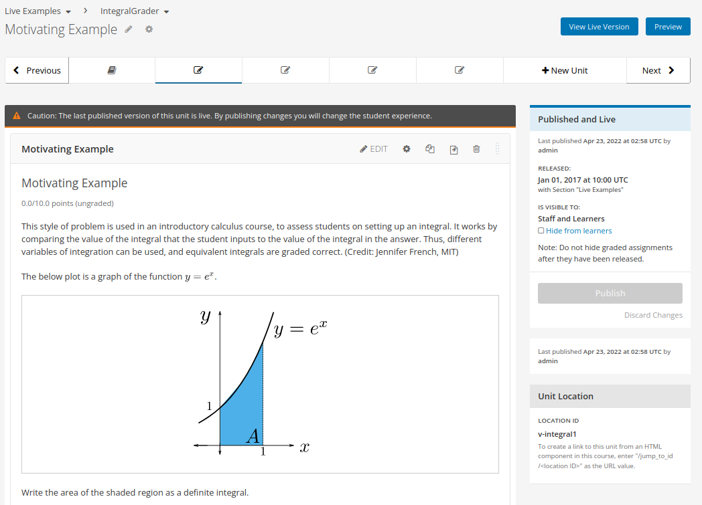

# Codejail plugin for [Tutor](https://docs.tutor.overhang.io)

[Codejail](https://github.com/openedx/codejail) is a Python library used to
manage the execution of Python code in a sandboxed environment.

This plugin configures and runs a remote CodeJail Service instance that
implements the safe-exec API used by the Open edX platform to offer more
advanced capabilities to course authors.

Starting from the Ulmo release, the codejail plugin is transitioning to an
alternative implementation of the safe-exec API (
[Codejail Service V2](https://github.com/openedx/codejail-service)). You can
opt-in to use this new implementation on Ulmo before it finally becomes the
default on the Verawood release.

> [!NOTE]
> The new CodeJail Service implementation is based on Django instead of Flask,
> therefore settings changed with the `codejail-*-settings` patches must be
> adjusted accordingly.

## Installation

To install the latest version, run:

``` bash
pip install tutor-contrib-codejail
# or install from the source
pip install git+https://github.com/edunext/tutor-contrib-codejail
```

## Requisites

By it's very nature of allowing arbitrary code execution, the CodeJail service
must be run under a hardened environment. The security guarantees are enforced
through AppArmor security profiles and thus necessitates the use of a Linux host
with support for AppArmor security module (usually Debian derived
distributions).

You can validate if your Linux host has AppArmor enabled by running:

```bash
aa-enabled
```

## Configuration

To customize the configuration, update the following settings in Tutor:

- `CODEJAIL_APPARMOR_DOCKER_IMAGE`: (default: `docker.io/ednxops/codejail_apparmor_loader:latest`)
- `CODEJAIL_DOCKER_IMAGE_V2` : (default: `{{ CODEJAIL_DOCKER_IMAGE }}-v2`)
- `CODEJAIL_DOCKER_IMAGE`: (default: `docker.io/ednxops/codejailservice:{{__version__}}`)
- `CODEJAIL_ENABLE_K8S_DAEMONSET` (default: `False`)
- `CODEJAIL_ENFORCE_APPARMOR` (default: `True`)
- `CODEJAIL_EXTRA_PIP_REQUIREMENTS` (default: `[]`)
- `CODEJAIL_SANDBOX_PYTHON_VERSION` (default: `3.11.9`)
- `CODEJAIL_SERVICE_REPOSITORY` (default: `https://github.com/edunext/codejailservice.git`\`)
- `CODEJAIL_SERVICE_VERSION` (default: `{{ OPENEDX_COMMON_VERSION }}`),
- `CODEJAIL_SERVICE_V2_REPOSITORY`: (default: `https://github.com/openedx/codejail-service.git`)
- `CODEJAIL_SERVICE_V2_VERSION`: (default: `{{ OPENEDX_COMMON_VERSION }}`)
- `CODEJAIL_USE_SERVICE_V2`: (default: `False`)

The `CODEJAIL_*_SERVICE_V2` settings are meant to be used only during the Ulmo
release and will be phased-out during the Verawood release.

To opt-in to the new implementation of the code-exec API set
`CODEJAIL_USE_SERVICE_V2` to `True` and re-deploy your environment. If you are
using a a custom image for the codejail service you will need to rebuild
it with `CODEJAIL_USE_SERVICE_V2` set to `True`.

### Custom Image

In most cases, you can work with the provided Docker image for the
release. You will need to build a custom image if you either:

- Need additional packages installed in the sandbox environment. Use the setting
  `CODEJAIL_EXTRA_PIP_REQUIREMENTS` to define the list of additional packages.
- Need to run the sandbox environment under a different Python version. The
  default Python version of the sandbox might get updated between releases,
  potentially breaking instructor generated code. You can set
  `CODEJAIL_SANDBOX_PYTHON_VERSION` to an older version to avoid disruption
  while figuring out a migration plan.

## Kubernetes Support

The CodeJail service provides a sandbox to run arbitrary code. Security
enforcement in the sandbox is done through *AppArmor*, this means that
AppArmor must be installed in the host machine, and the [provided
profile](tutorcodejail/templates/codejail/apps/profiles/docker-edx-sandbox)
must be loaded.

For Kubernetes environments, you must ensure each node has AppArmor installed
and has successfully loaded the profile.

You can enable a helper Daemon Set that will load the profile onto all the nodes
by setting `CODEJAIL_ENABLE_K8S_DAEMONSET` to true.

If you choose to run the service without enforcing the AppArmor profile
(absolutely discouraged, and not possible on the newer implementation of
codejail-service), you can set `CODEJAIL_ENFORCE_APPARMOR` to `False`.

More info about this discussion can be found on [this
issue](https://github.com/eduNEXT/tutor-contrib-codejail/issues/24).

## Testing Functionality

To verify if Codejail is working, use a course with loncapa problems in `Studio`
and check for correct execution. You can import the provided
[example course](https://github.com/eduNEXT/tutor-contrib-codejail/blob/main/docs/resources/course_codejail_example.tar.gz).

Once the course is imported, go to any section and select an exercise
([section example](http://studio.local.overhang.io:8001/container/block-v1:edX+DemoX+Demo_Course+type@vertical+block@v-integral1)),
the proper result is:

{.align-center
width="725px"}

In this case, the section\'s content will render correctly and work as
specified in the instructions of the problem.

## License

This software is licensed under the terms of the AGPLv3. See the LICENSE
file for details.

