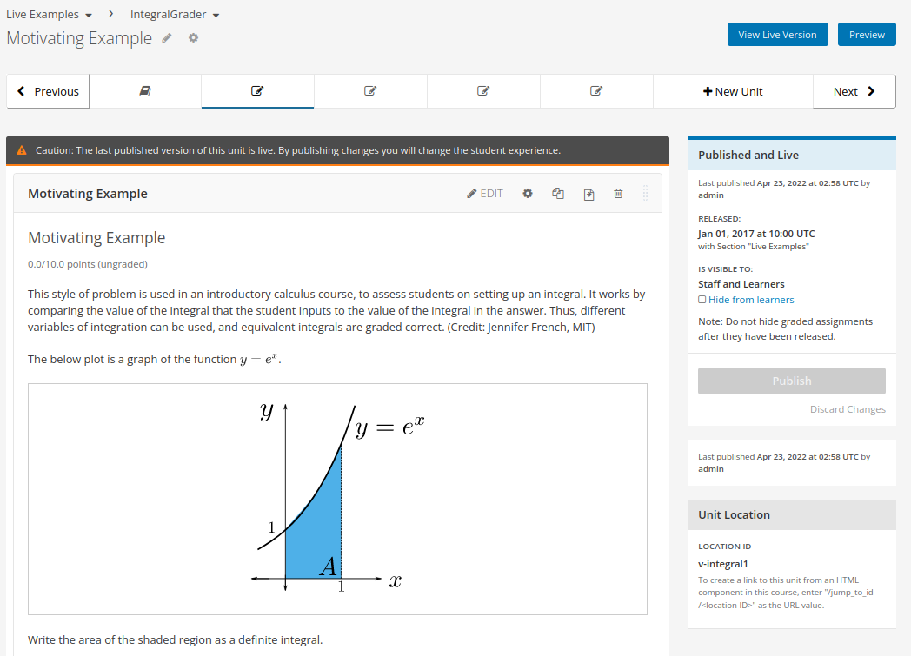

# Codejail plugin for [Tutor](https://docs.tutor.overhang.io)

[Codejail](https://github.com/openedx/codejail) is a Python library used to
manage the execution of Python code in a sandboxed environment.

This plugin configures and runs a remote CodeJail Service instance that
implements the safe-exec API used by the Open edX platform to offer more
advanced capabilities to course authors.

## Installation

To install the latest version, run:

``` bash
pip install tutor-contrib-codejail
# or install from the source
pip install git+https://github.com/edunext/tutor-contrib-codejail
```

## Requisites

By it's very nature of allowing arbitrary code execution, the CodeJail service
must be run under a hardened environment. The security guarantees are enforced
through AppArmor security profiles and thus necessitates the use of a Linux host
with support for AppArmor security module (usually Debian derived
distributions).

You can validate if your Linux host has AppArmor enabled by running:

```bash
aa-enabled
```

## Configuration

To customize the configuration, update the following settings in Tutor:

- `CODEJAIL_APPARMOR_DOCKER_IMAGE`: (default: `docker.io/ednxops/codejail_apparmor_loader:latest`)
- `CODEJAIL_DOCKER_IMAGE`: (default: `docker.io/ednxops/codejailservice:{{__version__}}`)
- `CODEJAIL_ENABLE_K8S_DAEMONSET` (default: `False`)
- `CODEJAIL_EXTRA_PIP_REQUIREMENTS` (default: `[]`)
- `CODEJAIL_SANDBOX_PYTHON_VERSION` (default: `3.12`)
- `CODEJAIL_SERVICE_REPOSITORY` (default: `https://github.com/openedx/codejail-service.git`)
- `CODEJAIL_SERVICE_VERSION` (default: `{{ OPENEDX_COMMON_VERSION }}`),

### Custom Image

In most cases, you can work with the provided Docker image for the
release. However, there might be cases when a custom image will be necessary:

- If you need additional packages installed in the sandbox environment. Use the
  setting `CODEJAIL_EXTRA_PIP_REQUIREMENTS` to define the list of additional
  packages.
- If you need to run the sandbox environment under a different Python version
  you can use `CODEJAIL_SANDBOX_PYTHON_VERSION`. This is particularly useful
  when the sandbox version is upgraded between releases but you need to figure
  out a migration plan for instructor code.
- If you need a completely different set of packages in the sandbox virtual
  environment. In this case you will need to point to a requirements file using
  the following docker build arguments: `SANDBOX_DEPS_REPO`,
  `SANDBOX_DEPS_VERSION`, `SANDBOX_DEPS_SRC_DIR` and `SANDBOX_DEPS_SRC_FILE`.
  Their current default values are
  `https://github.com/openedx/codejail-service.git`, `{{ OPENEDX_COMMON_VERSION
  }}`, `requirements/sandbox` and `base.txt`. This will point to
  https://github.com/openedx/codejail-service/blob/release/verawood.1/requirements/base.txt
  for the Verawood release. You can provide the arguments to Tutor as follows
  `tutor images build codejail -a SANDBOX_DEPS_VERSION=ulmo2`.

## Kubernetes Support

The CodeJail service provides a sandbox to run arbitrary code. Security
enforcement in the sandbox is done through *AppArmor*, this means that
AppArmor must be installed in the host machine, and the [provided
profile](tutorcodejail/templates/codejail/apps/profiles/docker-edx-sandbox)
must be loaded.

For Kubernetes environments, you must ensure each node has AppArmor installed
and has successfully loaded the profile.

You can enable a helper Daemon Set that will load the profile onto all the nodes
by setting `CODEJAIL_ENABLE_K8S_DAEMONSET` to true.

More info about this discussion can be found on [this
issue](https://github.com/eduNEXT/tutor-contrib-codejail/issues/24).

## Testing Functionality

To verify if Codejail is working, use a course with loncapa problems in `Studio`
and check for correct execution. You can import the provided
[example course](https://github.com/eduNEXT/tutor-contrib-codejail/blob/main/docs/resources/course_codejail_example.tar.gz).

Once the course is imported, go to any section and select an exercise
([section example](http://studio.local.overhang.io:8001/container/block-v1:edX+DemoX+Demo_Course+type@vertical+block@v-integral1)),
the proper result is:

{.align-center
width="725px"}

In this case, the section\'s content will render correctly and work as
specified in the instructions of the problem.

## New CodeJail Service implementation

The Ulmo release introduced support for deploying a new
implementation of the remote CodeJail service (openedx/codejail-service). The
Verawood release completely removes support for deploying the old version of the
service (edunext/codejailservice). Users should be mindful of the following
points when upgrading:

1. The new CodeJail service **requires** AppArmor 4 on the host machine.
   AppArmor 4 is available on relatively new Debian based distributions (ubuntu
   24.04, Debian Trixie, etc).
2. AppArmor enforcement is no longer optional. The new CodeJail service performs
   startup checks to ensure the sandbox is properly isolated and will not start
   if the AppArmor profile is not loaded and configured.
3. The new CodeJail service implementation is based on Django instead of Flask.
   Any usage of the `codejail-*-settings` must be adjusted accordingly.

## License

This software is licensed under the terms of the AGPLv3. See the LICENSE
file for details.
