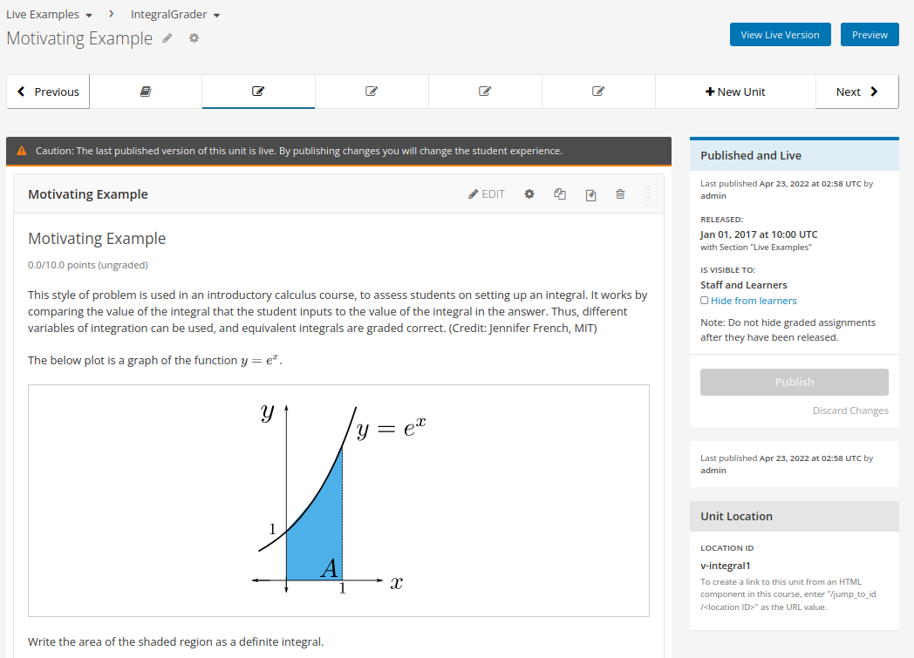

codejail plugin for `Tutor <https://docs.tutor.overhang.io>`__
===================================================================================

Tutor plugin that enables execution of untrusted code in secure sandboxes using an external `service`_ based on the `codejail`_ library.

.. _service: https://github.com/eduNEXT/codejailservice
.. _codejail: https://github.com/openedx/codejail

Installation
------------

.. code-block:: bash

    pip install git+https://github.com/edunext/tutor-contrib-codejail

Usage
-----

.. code-block:: bash

    tutor plugins enable codejail

Then, you will have to install the "docker-edx-sandbox" apparmor profile on your host:

.. code-block:: bash

    tutor config save
    tutor local init --limit=codejail

Finally, the platform can be run as usual:

.. code-block:: bash

    tutor local quickstart

Compatibility
-------------

+-------------------+----------------+
| Open edX Release  |  Tutor Version |
+===================+================+
+-------------------+----------------+
|       Lilac       |    >= 12.x     |
+-------------------+----------------+
|       Maple       |    >= 13.x     |
+-------------------+----------------+

Functionality test
------------------

How to know if codejail is working
~~~~~~~~~~~~~~~~~~~~~~~~~~~~~~~~~~~~~~

The easiest way to test whether codejail is working is to validate it in ``Studio`` with a course
that has loncapa problems exercises.

This test was performed on the Maple version of Open edx, using the course ``course_codejail_example.tar.gz``
found in the additional resources section.

Once the course is imported, go to any section and select an exercise (`section example`_`), the proper result is:

.. _section example: http://studio.maple.edunext.link:8001/container/block-v1:edX+DemoX+Demo_Course+type@vertical+block@v-integral1

In this case, the section's content will render correctly and will be working as specified in the instructions of the problem.

Possible failure case
~~~~~~~~~~~~~~~~~~~~~

In case you forget to run ``tutor local init --limit=codejail`` for apparmor profile, the error you can find in 
``Studio`` is as follows::

    Error formatting HTML for problem:
    cannot create LoncapaProblem block-v1:edX+DemoX+Demo_Course+type@problem+block@integral1: Error while
    executing script code: Codejail API Service is unavailable. Please try again in a few minutes.

.. image:: ./resourcesfiles/Codejailfail.png
    :width: 750px
    :align: center
    :alt: Example when codejail is not working

This indicates that the codejail service is not turned on or is not working properly. Be sure to follow the
steps in the usage section so this doesn't happen.

Additional Resources
--------------------

Example course to test the Codejail service: `course_codejail_example.tar.gz`_

.. _course_codejail_example.tar.gz: https://github.com/eduNEXT/tutor-contrib-codejail/blob/main/resourcesfiles/course_codejail_example.tar.gz

How to Contribute
-----------------

Contributions are welcome! See our `CONTRIBUTING`_ file for more
information – it also contains guidelines for how to maintain high code
quality, which will make your contribution more likely to be accepted.

.. _CONTRIBUTING: https://github.com/eduNEXT/tutor-contrib-codejail/blob/main/CONTRIBUTING.rst

License
-------

This software is licensed under the terms of the AGPLv3.
